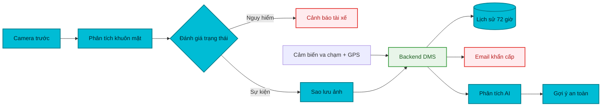

<div align="center">

# 🚘 DMS — Driver Monitoring System

### Giám sát tài xế theo thời gian thực · Cảnh báo sớm · Hỗ trợ khẩn cấp

[](https://developer.android.com/)
[](https://kotlinlang.org/)
[](https://dotnet.microsoft.com/)
[](https://firebase.google.com/)
[](LICENSE)
[](https://github.com/Vudinhdat02/dmsApplication)

**DMS** là hệ thống hỗ trợ giám sát trạng thái người lái bằng camera trước của điện thoại. Ứng dụng phân tích khuôn mặt ngay trên thiết bị, đưa ra cảnh báo tức thời và kết nối với backend riêng để bảo vệ API key, lưu ảnh sự kiện và xử lý các tác vụ trực tuyến.

</div>

---

## Tổng quan hoạt động



## Tính năng nổi bật

| Nhóm | Khả năng |
|---|---|
| 👁️ Giám sát | Phát hiện nhắm mắt, ngáp, quay đầu, mất khuôn mặt bằng MediaPipe Face Landmarker |
| ⚙️ Hiệu chỉnh | Hiệu chỉnh trạng thái khuôn mặt và ngưỡng EAR theo người dùng |
| 🔊 Cảnh báo | Cảnh báo trực tiếp bằng âm thanh, rung và hiển thị trên màn hình |
| 🚨 Khẩn cấp | Nhận biết va chạm từ cảm biến gia tốc, lấy vị trí GPS và gửi email cho người liên hệ |
| 🖼️ Sao lưu | Tải ảnh sự kiện lên backend ngay lập tức; tự thử lại khi mạng gián đoạn |
| 🕒 Lưu trữ | Phân vùng dữ liệu theo tài khoản và tự động xóa ảnh quá 72 giờ |
| 📊 Thống kê | Theo dõi lịch sử, hiệu suất lái xe và nhận lời khuyên an toàn từ AI |
| 🌓 Giao diện | Hỗ trợ Light Mode và Dark Mode theo cài đặt hệ thống |

## Kiến trúc

### Android

- **Kotlin**, Android SDK 26+ và kiến trúc MVVM.
- **CameraX** thu nhận khung hình từ camera trước.
- **MediaPipe Face Landmarker** xác định các điểm đặc trưng khuôn mặt.
- **EAR, MAR và Head Pose** đánh giá mắt, miệng và hướng đầu.
- **Room** lưu dữ liệu cục bộ; **WorkManager** đồng bộ lại khi có mạng.
- **Firebase Authentication/Firestore** quản lý tài khoản và người liên hệ.
- **Retrofit, OkHttp và Glide** giao tiếp API và tải ảnh có xác thực.

### Backend

- **ASP.NET Core .NET 10** với REST API và Swagger trong môi trường Development.
- Xác thực mọi API riêng tư bằng **Firebase ID Token**.
- Giới hạn tần suất gọi API, kích thước ảnh và kiểm tra định dạng file.
- **SQLite + hệ thống file** lưu metadata và ảnh riêng theo Firebase UID.
- **Groq** cung cấp phân tích AI; **Brevo** gửi email cảnh báo khẩn cấp.
- API key được lưu bằng **.NET User Secrets**, không nằm trong source code.

Chi tiết backend: [DMSServer/DMSbackend/README.md](DMSServer/DMSbackend/README.md)

## Cấu trúc repository

```text
dmsApplication/
├── app/                         # Ứng dụng Android
│   └── src/main/
│       ├── java/.../data/       # Room, repository và API client
│       ├── java/.../ml/         # Phân tích khuôn mặt và thuật toán DMS
│       ├── java/.../ui/         # Activity, Fragment và ViewModel
│       └── res/                 # Layout, theme, màu sắc và tài nguyên
├── DMSServer/
│   └── DMSbackend/              # Backend ASP.NET Core
│       ├── Controllers/         # AI, cảnh báo, ảnh và health check
│       ├── Services/            # Groq, Brevo, Firestore và dọn ảnh
│       ├── Data/                # Entity Framework Core + SQLite
│       └── Program.cs           # Cấu hình ứng dụng và bảo mật
├── face_landmarker.task         # Mô hình MediaPipe
└── gradle/                      # Cấu hình build Android
```

## Yêu cầu phát triển

- JDK 17 và Android SDK; Android Studio là tùy chọn.
- Android SDK 26 trở lên; compile SDK 36.
- .NET SDK 10; Visual Studio 2022 là tùy chọn.
- Firebase project, Groq API key và Brevo API key.

## Bắt đầu nhanh

### 1. Clone repository

```bash
git clone https://github.com/Vudinhdat02/dmsApplication.git
cd dmsApplication
```

### 2. Cấu hình backend

Mở terminal tại `DMSServer/DMSbackend`:

```powershell
dotnet user-secrets set "Groq:ApiKey" "YOUR_GROQ_API_KEY"
dotnet user-secrets set "Brevo:ApiKey" "YOUR_BREVO_API_KEY"
dotnet user-secrets set "Brevo:SenderEmail" "YOUR_VERIFIED_SENDER_EMAIL"
```

Chạy backend bằng lệnh dotnet run --project DMSServer/DMSbackend/DMSbackend.csproj; hoặc mở solution bằng Visual Studio và nhấn **F5**.

- Health check: `http://localhost:5078/health`
- Swagger: `http://localhost:5078/swagger`

### 3. Cấu hình Android

Đặt file Firebase `google-services.json` vào thư mục `app/`. Thêm URL backend vào `local.properties`:

```properties
SERVER_BASE_URL=https://your-server-or-dev-tunnel.example/
```

Với Android Emulator và backend chạy trên cùng máy:

```properties
SERVER_BASE_URL=http://10.0.2.2:5078/
```

Build ứng dụng:

```powershell
./gradlew.bat assembleDebug
```

APK được tạo tại `app/build/outputs/apk/debug/app-debug.apk`.

Hướng dẫn đầy đủ cho Windows, Linux/macOS, cấu hình release và build sạch: [BUILDING.md](BUILDING.md).

## API chính

| Method | Endpoint | Mô tả | Xác thực |
|---|---|---|---|
| `GET` | `/health` | Kiểm tra trạng thái backend | Không |
| `POST` | `/api/analyze-driving` | Phân tích dữ liệu lái xe bằng AI | Firebase JWT |
| `POST` | `/api/send-crash-alert` | Gửi cảnh báo khẩn cấp | Firebase JWT |
| `POST` | `/api/images/upload` | Sao lưu ảnh sự kiện | Firebase JWT |
| `GET` | `/api/images` | Danh sách ảnh của tài khoản | Firebase JWT |
| `GET` | `/api/images/{id}` | Xem ảnh thuộc tài khoản | Firebase JWT |
| `DELETE` | `/api/images/{id}` | Xóa ảnh thuộc tài khoản | Firebase JWT |

## Bảo mật và quyền riêng tư

- Không nhúng Groq, Brevo hoặc khóa backend vào APK.
- App gửi Firebase ID Token trong header `Authorization: Bearer`.
- Backend chỉ cho phép người dùng truy cập ảnh thuộc UID của chính họ.
- Ảnh quá 72 giờ được dọn tự động ở phía server.
- `App_Data`, database, ảnh, certificate, `.env` và `secrets.json` đều bị Git bỏ qua.
- Không commit nội dung của `local.properties` hoặc .NET User Secrets.

## Kiểm thử

```powershell
# Kiểm tra build Android
./gradlew.bat assembleDebug

# Kiểm tra build backend
dotnet build DMSServer/DMSbackend.slnx
```

Repository hiện chưa có bộ kiểm thử tự động hoàn chỉnh. Xem trạng thái thực tế tại [TESTING.md](TESTING.md).

## Đóng góp

1. Tạo branch từ `master`.
2. Thực hiện thay đổi và kiểm tra cả Android lẫn backend.
3. Không commit API key, dữ liệu người dùng hoặc file build.
4. Mở Pull Request kèm mô tả và kết quả kiểm thử.

## Giấy phép

Mã nguồn do dự án DMS phát triển được phát hành theo [Apache License 2.0](LICENSE). Xem [NOTICE](NOTICE), [THIRD_PARTY_NOTICES.md](THIRD_PARTY_NOTICES.md) và [docs/MODEL_CARD.md](docs/MODEL_CARD.md) trước khi phân phối lại ứng dụng hoặc model đi kèm.

> [!IMPORTANT]
> DMS là dự án hỗ trợ nghiên cứu và cảnh báo. Hệ thống không thay thế sự tập trung của người lái, thiết bị an toàn được chứng nhận hoặc dịch vụ cứu hộ chuyên nghiệp.

---

<div align="center">

Phát triển với mục tiêu ứng dụng AI để nâng cao an toàn giao thông.

</div>